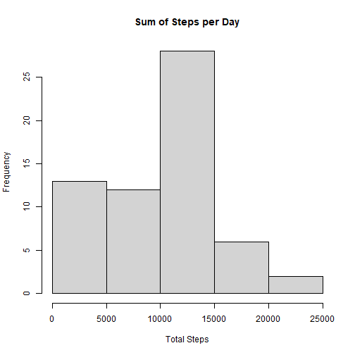
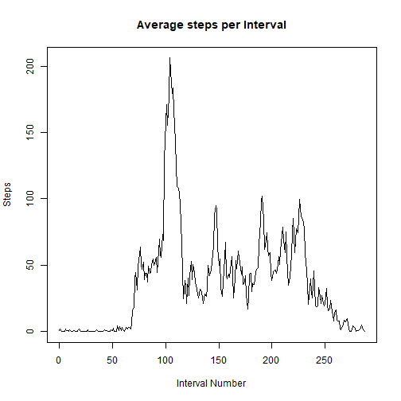
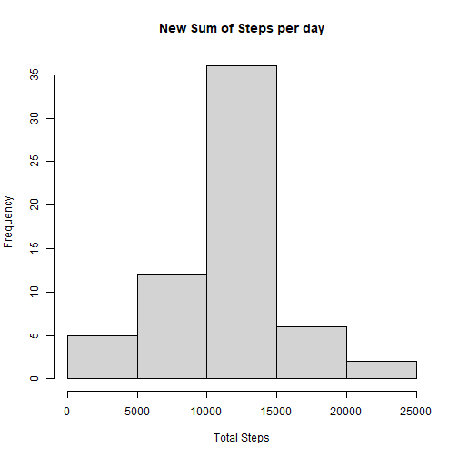
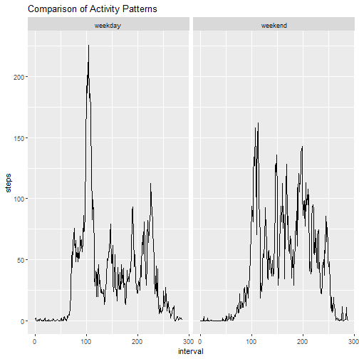

The analysis utilized the the *dplyr* and *ggplot2* libraries.

```r
library("dplyr")
library("ggplot2")
```

## Loading and preprocessing the data
The *date* variable is converted to *Date* class.

```r
actData<-read.csv("activity.csv")
actDate0<-as.Date(actData$date)
actData$date<-actDate0
```

## What is mean total number of steps taken per day?


```r
sumSteps<-group_by(actData, date)%>%summarize(totSteps=sum(steps,na.rm=TRUE))
meanDailySteps<-mean(sumSteps$totSteps)
medianDailySteps<-median(sumSteps$totSteps)
```
The mean of the total number of steps is **9354.2295082** and the median is **10395**.


```r
hist(sumSteps$totSteps, main="Sum of Steps per Day", xlab="Total Steps")
```



## What is the average daily activity pattern?
Activity peaks in around the 100th interval (about 8:30am) period as seen in the plot.


```r
grByInt<-group_by(actData, as.numeric(row.names(actData))%%288)
what<-summarize(grByInt, mean(steps, na.rm=TRUE))
names(what)<-c("interval","steps")
plot(x=what$interval,y=what$steps, type="l" ,main="Average steps per Interval", xlab="Interval Number", ylab="Steps")
```



```r
maxsteps<-what[which.max(what$steps),]
```
The interval with the highest average steps is **104** with **206.1698113** steps

## Imputing missing values


```r
sum(is.na(actData$steps))
```
There are 2304 missing values in the step variable. They were replaced with the average of the steps for that interval.


```r
newActData<-grByInt
names(newActData)<-c("steps", "date","interval","intGrp")
newActData$steps[is.na(newActData$steps)] <- what$steps[newActData$intGrp]
sumStepsNew<-group_by(newActData, date)%>%summarize(totSteps=sum(steps,na.rm=TRUE))
hist(sumStepsNew$totSteps, main="New Sum of Steps per day", xlab="Total Steps")
```



```r
meanDailyStepsNew<-mean(sumStepsNew$totSteps)
medianDailyStepsNew<-median(sumStepsNew$totSteps)
```
Both the mean and median number of steps increase after the missing vales replaced. The new mean of the total number of steps is **1.0766259 &times; 10<sup>4</sup>** and the new median is **1.0766302 &times; 10<sup>4</sup>**.

## Are there differences in activity patterns between weekdays and weekends?
There is a overall higher level of activity on weekends than weekdays. The most active intervals are however occur on a weekday.


```r
newActData$daytype <- as.factor(ifelse(weekdays(newActData$date)=='Sunday'|weekdays(newActData$date)=='Saturday', 'weekend','weekday'))
grByIntWd<-group_by(newActData, daytype, as.numeric(row.names(newActData))%%288)
nowwhat<-summarize(grByIntWd, mean(steps, na.rm=TRUE))
names(nowwhat)<-c("daytype","interval","steps")
p9<-ggplot(nowwhat)+geom_line(mapping=aes(x=interval, y=steps))+facet_grid(~daytype)+ labs(title="Comparison of Activity Patterns")
print(p9)
```


